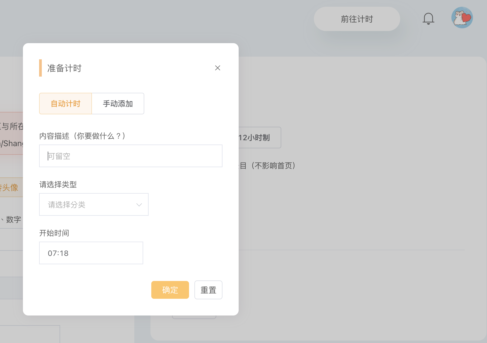
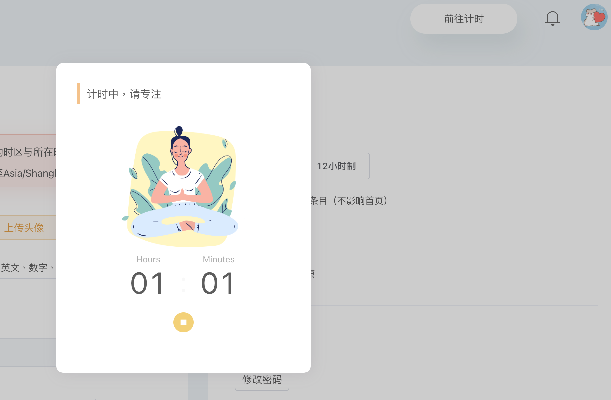
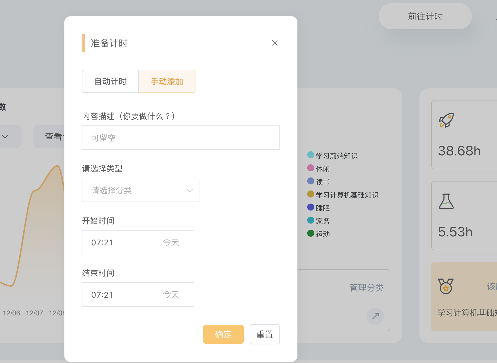
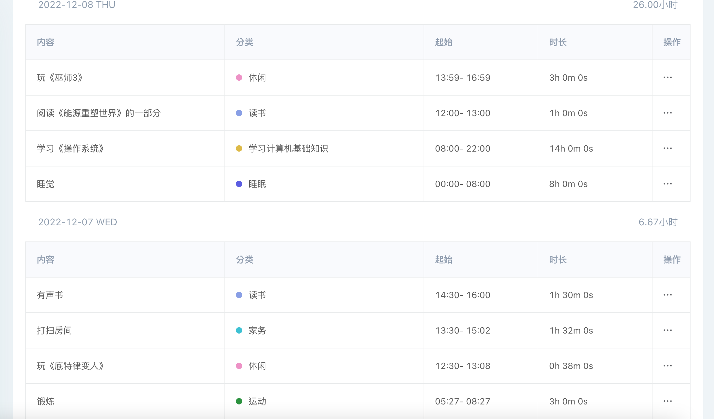
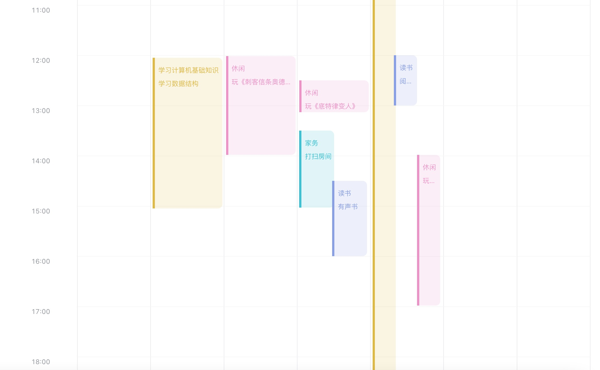
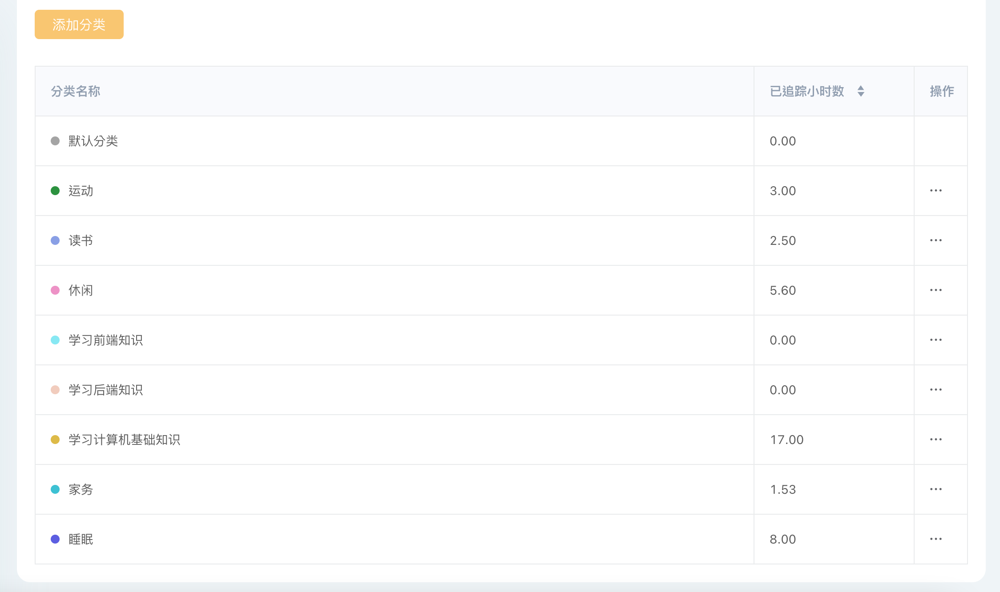
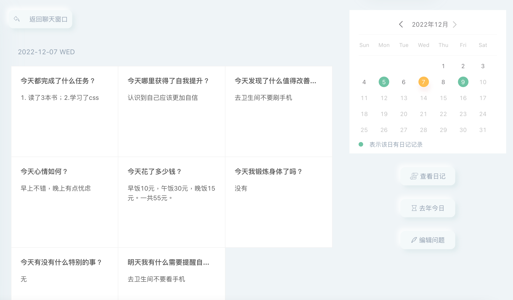
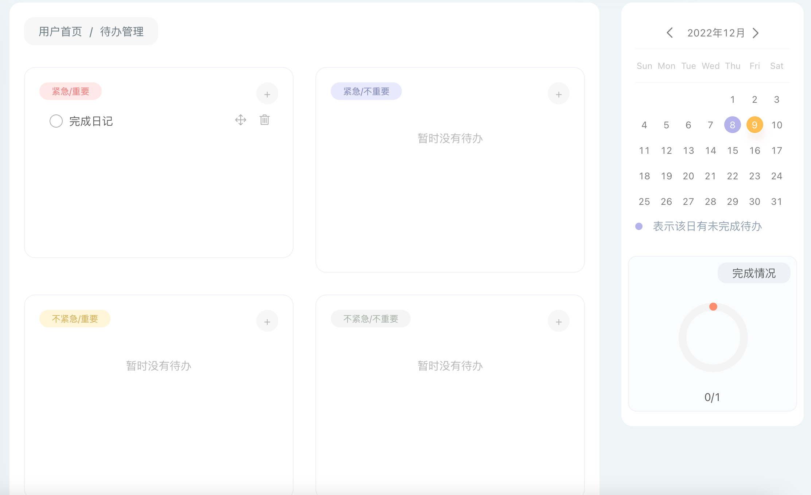
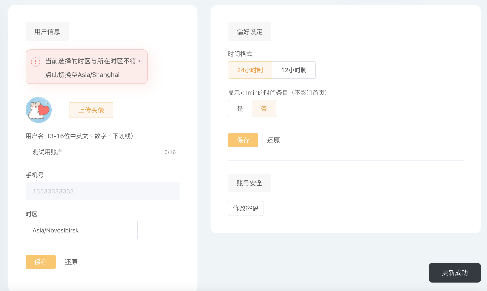

# 个人项目-网站易弦

## 介绍
个人项目-网站易弦，使用Vuejs+ SpringBoot完成，网站设计、前后端代码、上线均由个人完成。网站为响应式布局。
该项目是一个个人生产力工具，最主要的功能模块是：1.待办管理；2. 时间追踪；3.九宫格日记；
线上地址: www.yixian-string.cn

## 前端主要使用：
1. vueRouter
2. vuex(主要用来实现用户登录状态的保存)
3. mitt（用于传递事件）
4. vue-toaster（用于消息提示）
5. bootstrap（用于响应式布局）
6. dayjs（用于时间相关处理）
7. element-ui（使用了其中部分组件）
8. axios（用于发送ajax请求）
9. apex-charts（用于生成图表）

## 后端主要使用：
1. SpringBoot
2. Spring Data JPA实现数据库访问和操作

## 页面和功能模块介绍
#####  1. landing page未登录用户看到的界面
.png)

#####  2. 注册、登录、找回密码 
后端通过榛子云短息服务实现验证码发送

#####  3. 用户首页（用户登录后看到的页面）

#####  4. 时间追踪
点击header的“计时”按钮之后，可进行时间记录的添加。有两种模式：

（1）自动模式:填写相关表单后会进入计时模式，暂停计时后时间条目会添加到自己的时间清单中；（关闭浏览器不影响计时）

（2）手动模式:自己输入开始结束时间

#####  5. 时间清单
可实现功能：
（1）查看某一周的数据统计

（2）以列表和时间表形式查看时间块分布

列表

时间表

（3）管理时间条目分类

##### 6.日记撰写
（1）聊天形式写日记

 (2) 历史日记查看编辑

 (3) 编辑日记问题

##### 7.待办管理
可根据优先级添加待办，可进行待办拖拽调整顺序和优先级，待办描述为content-editable,可直接编辑描述内容，然后点击别的地方即可实现保存。

##### 8.通知处理

##### 9.个人设置
可进行个人资料和偏好的修改

